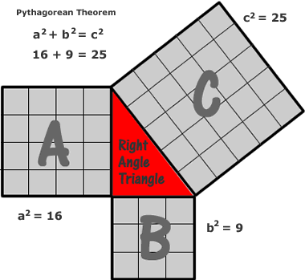
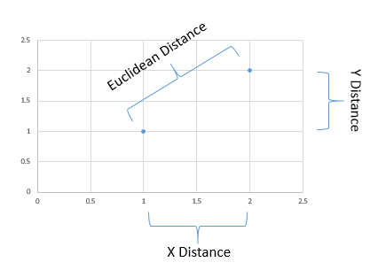

# IA05: Functions and Measuring Distance between observations


In data science/analytics, observations often include many different features (multi-dimensions), generally, the more the better. Considering this, it is often quite useful to have a __systematic__ way to __measure__ the "similarity" (or conversely, "dissimilarity") between any two data points (observations) in a multi-dimensional dataset.

Some examples where this might be useful:
* Calculating the similarity between two difference stocks, (or dissimilarity if we are looking to hedge)
* Clustering customers based on their preferences, or any other data we have on them.
* Measuring the similarity of products based on known features.

In this exercise, you will build on your work from IA04 to create a program that, given a university name, calculates and returns the university that is most similar and another university that is least similar (with the remaining set).

In this exercise, you will continue to develop your Python skills, and expand your knowledge of basic data science algorithms and concepts (IA04 was focused on standardizing measures, in this one, you'll measure "distances").

## Background

Within data science, you'll find multiple measures of "distance". It's an important concept that is used within many algorithms (such as k-means clustering, which we will discuss later in the course). One of the more common approaches to measuring distance is using Euclidean distance. In this assignment you will explore and use Euclidean distance as a measure of similarity (and conversely, dissimilarity).

> In simplest terms, Euclidean distances is simply the distance you'd measure if you could put a ruler up between any two of your datapoints.

Euclidean distance is also fairly easily understood, as it's based on the Pythagorean theorem.

### Pythagorean theorem

The Pythagorean theorem defines a fundamental relation in Euclidean geometry among the three sides of a right triangle (you remember, right?). The Pythagorean theorem states that the square of the hypotenuse (the side opposite the right angle) is equal to the sum of the squares of the other two sides.



This theorem is named after the ancient Greek mathematician Pythagoras (c. 570-495 BC). The relationship was known prior to Pythagoras. but it was Pythagoras that produced the first known proof for this, and thus, by tradition, we now associate his name with this relationship.

### Euclidean geometry

Euclid was another ancient Greek mathematician. One of Euclid's accomplishments was to present previous works of geometry into a single, logically coherent framework. Included was a system of rigorous mathematical proofs that continues to be the basis of many aspects of geometry and general mathematics - and, as we will see, plays a role in data science as well.

I'll spare you the details about how Euclidean's work produced the concept of distances (it's a rather interesting progression from Euclidean planes, to Cartesian planes -- a special instance of a Euclidean plane), and instead jump to its more practical implications.

### Euclidean Distances in 2 dimensions

One interesting outcome from Euclidean's work is that we can generalize the Pythagorean Theorem to multiple dimensions.

Looking at two dimensional space:



In a two dimensional "space", we can easily calculate the "distance" between point A to point be is the root of the X squared distance plus the Y squared distance. This is what we call the Euclidean distance, and it looks just like the Pythagorean theorem.

Now, using our example from last IA04, let's say we wanted to compare cars. Furthermore, let's say we have a dataset consisting of measures of price and fuel-economy of 50 of the most popular cars being sold today. If we choose one of these cars, and ask the question, which of the remaining 49 cars are most similar to this car, we can answer this question by finding which of these have the shortest Euclidean distance to the car we are interested in. Answering this question would simply involve calculating the difference in fuel economy and the difference in price between the car we are interested in and each of the other 49, and using Euclidean distance formula (which looks just like the Pythagorean formula), calculate the distance between the car we are looking at each of the other 49. Whichever of these other cars produces the shortest Euclidean distance will be the car most similar to the one we have picked. (Yes, you may argue that the results don't seem to produce what you would consider "similar" results, but what we are doing is basing this on only two dimensions (or features); the features we add to the dataset, the more "real" our calculation becomes)

## Euclidean Distances in multi-dimensions

What we have covered thus far would be known to you from high-school math (maybe middle school), but what may be new is that this Euclidean distance can be calculated within any n-dimensional space (not just 2 dimensions).

For three dimensions, therefore, our Euclidean distance would be the root of the squared X distance plus squared Y distance plus squared Z distance. And, this pattern would continue for any number of dimensions.

So, for instance, if we had car data that had a third dimension, say customer satisfaction, we calculate Euclidean distance as the root of ( fuel economy squared plus price squared plus consumer satisfaction squared). If we add a fourth, fifth, or even a 100th dimension, this pattern would continue, and we could calculate which car would be most similar.

### The role of standardizing the variable
In our last exercise we standardized a number of measures relating to universities. This standardization process is a useful way of eliminating the influence of scale, which can distort results in any measure of multi-dimensional distance. So, in data science, we will often standardize our variable before calculating a measure of Euclidean distance (similarity). In the last exercise, that is what you have already done. In this exercise, we will take your standardized measures and calculate a Euclidean distance based on these standardized values.

# Task

Your task is to use the IA04.sqlite database you created in the last IA to create a command line interface for users to enter a University name, and return the closest (based on Euclidean distance) to this one.

1) copy ia04.sqlite into your IA05 directory.
2) rename ia04.sqlite to ia05.sqlite
3) Using Python and your ia05.sqlite database, create a function call Euclidean distance. This function will accept a University name, and return the name of most and least similar University (based on Euclidean distances) in the remaining set.
4) Write a Python program that uses your function to create a command line interface (argument passing) the provides the following functionality,

4a) The basic functionality will be to access a university name and return the most and least similar (closest and furthest measure of Euclidean distance) school:
```
python unisim.py "Amherst"
Based on our calculation, a most similar University to Amherst is Bowdoin (Euclidean distance 0.495940108), while the least similar is Cal Tech (Euclidean distance of 5.686779123)

```
__NOTE__: The quotes around the university names are necessary as some universities in our sample have multi-word names.

4b) Your program should also create a list of universities so that the user can choose.

```
python unisim.py -l
Amherst     
Swarthmore
Duke
Pomona
Rice
Bowdoin
Carleton
U of Chicago
Williams
Wesleyan (CT)
Princeton
Johns Hopkins
Vassar
Haverford
Brown
Syracuse
U Pennsylvania
Cornell
Yale
Georgetown
MIT
Columbia
Harvard
Stanford
Claremont McKenna
Colgate
Middlebury
Bryn Mawr
Wellesley
Oberlin
Grinnell
Bates
Washinton and Lee
Davidson
Northwestern
Cal Tech
Washington U (MO)
Carnegie Mellon
Barnard
U Va
Hamilton
Colby
Mount Holyoke
Smith
U Michigan
Berkeley
Occidental
U of Rochester
UCLA
UNC
```

4c) Your program should provide help.

```
python unisim.py -h
This program will... (say something about what it does)
```

Finally, If a user doesn't enter any value, or enters an unrecognized value, it should display the help information.


__NOTE__: I've added an excel file to demonstrate the calculations (see [universities_EDIST.xlsx](universities_EDIST.xlsx))
